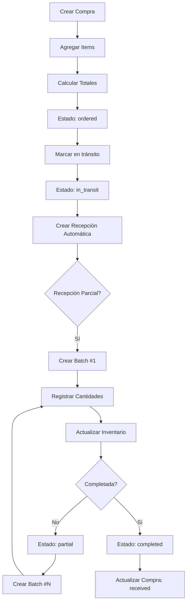
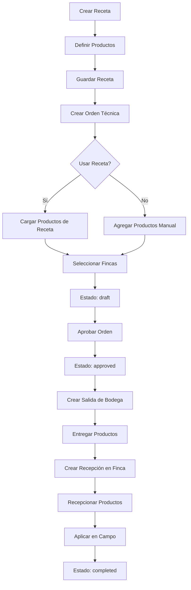
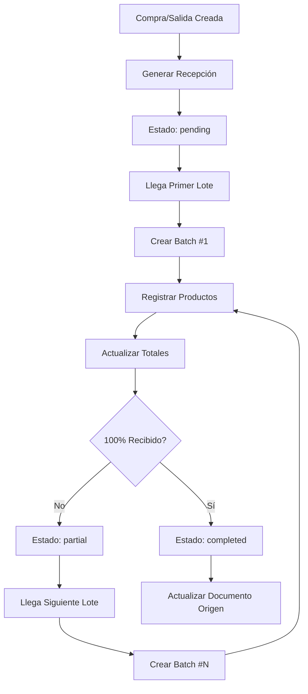

# ANÁLISIS COMPLETO DEL FRONTEND AGRIFLOR
## Documentación para Implementación del Backend Laravel

**Fecha de Análisis:** 2025-11-14
**Versión:** 1.0
**Proyecto:** Sistema de Gestión de Inventario Agrícola AgriFlor

---

## 1. RESUMEN EJECUTIVO

AgriFlor es un sistema completo de gestión de inventario para productos agrícolas (agroquímicos) que abarca:
- Gestión de datos maestros (productos, marcas, proveedores, ubicaciones)
- Procesos técnicos (recetas y órdenes técnicas)
- Gestión de compras y recepciones
- Control de salidas y transferencias
- Inventario y kardex
- Sistema de alertas y reportes

### Características Principales:
- **Sistema de unidades de empaque** flexible (conversión automática)
- **Recepción unificada** para compras y salidas
- **Recepciones parciales** ilimitadas con historial de batches
- **5 roles de usuario** con permisos diferenciados
- **Trazabilidad completa** de todos los movimientos
- **Alertas automáticas** por stock bajo, productos vencidos, etc.

---

## 2. ARQUITECTURA DEL SISTEMA

### 2.1. Stack Tecnológico Frontend
- **Framework:** React 18 + TypeScript
- **Enrutamiento:** React Router
- **UI:** Ant Design
- **Estado:** React Query
- **Fechas:** Day.js
- **PDF:** jsPDF

### 2.2. Módulos Principales

```
├── Datos Maestros
│   ├── Productos
│   ├── Marcas
│   ├── Proveedores
│   └── Ubicaciones (Fincas/Bodegas)
├── Procesos Técnicos
│   ├── Recetas Técnicas
│   └── Órdenes Técnicas
├── Gestión de Compras
│   ├── Órdenes de Compra
│   ├── Salidas
│   └── Recepción Unificada
├── Inventario
│   └── Inventario y Kardex
├── Reportes
│   ├── Alertas
│   └── Reportes Inteligentes
└── Administración
    └── Usuarios
```

---

## 3. MODELO DE DATOS COMPLETO

### 3.1. USUARIOS (users)

| Campo | Tipo | Descripción | Reglas |
|-------|------|-------------|--------|
| id | UUID | Identificador único | PK |
| email | VARCHAR(255) | Email del usuario | UNIQUE, NOT NULL |
| name | VARCHAR(255) | Nombre completo | NOT NULL |
| password | VARCHAR(255) | Contraseña hasheada | NOT NULL |
| role | ENUM | Rol del usuario | NOT NULL |
| status | ENUM | Estado del usuario | DEFAULT 'active' |
| created_at | TIMESTAMP | Fecha de creación | |
| updated_at | TIMESTAMP | Fecha de actualización | |

**Valores ENUM:**
- **role:** 'admin', 'agronomist', 'warehouse', 'supervisor', 'farm'
- **status:** 'active', 'inactive'

**Roles y Permisos:**
1. **admin** - Administrador del sistema (acceso total)
2. **agronomist** - Agrónomo (recetas, órdenes técnicas, reportes)
3. **warehouse** - Bodeguero (compras, entradas, salidas, inventario)
4. **supervisor** - Supervisor (visualización y aprobaciones)
5. **farm** - Operario de finca (recepción en fincas, aplicaciones)

---

### 3.2. MARCAS (brands)

| Campo | Tipo | Descripción | Reglas |
|-------|------|-------------|--------|
| id | UUID | Identificador único | PK |
| name | VARCHAR(255) | Nombre de la marca | UNIQUE, NOT NULL |
| status | ENUM | Estado | DEFAULT 'active' |
| created_at | TIMESTAMP | Fecha de creación | |

**Valores ENUM:**
- **status:** 'active', 'inactive'

---

### 3.3. PRODUCTOS (products)

| Campo | Tipo | Descripción | Reglas |
|-------|------|-------------|--------|
| id | UUID | Identificador único | PK |
| name | VARCHAR(255) | Nombre del producto | NOT NULL |
| brand_id | UUID | Marca del producto | FK → brands.id |
| category | ENUM | Categoría del producto | NOT NULL |
| base_unit | ENUM | Unidad base | NOT NULL |
| active_ingredient | VARCHAR(255) | Principio activo | NOT NULL |
| min_stock | DECIMAL(10,2) | Stock mínimo | DEFAULT 0 |
| status | ENUM | Estado del producto | DEFAULT 'active' |
| description | TEXT | Descripción | |
| created_by | UUID | Usuario que creó | FK → users.id |
| created_at | TIMESTAMP | Fecha de creación | |
| updated_at | TIMESTAMP | Fecha de actualización | |

**Valores ENUM:**
- **category:** 'fertilizante', 'pesticida', 'herbicida', 'fungicida'
- **base_unit:** 'kg', 'litros', 'unidades'
- **status:** 'active', 'inactive'

**Relaciones:**
- Pertenece a una Marca (N:1)
- Tiene múltiples Unidades de Empaque (N:M)
- Usado en Recetas (N:M)
- Comprado en Órdenes de Compra (N:M)

---

### 3.4. UNIDADES DE EMPAQUE (packaging_units)

**IMPORTANTE:** Sistema clave para conversión de unidades

| Campo | Tipo | Descripción | Reglas |
|-------|------|-------------|--------|
| id | UUID | Identificador único | PK |
| name | VARCHAR(100) | Nombre de la unidad | NOT NULL |
| base_quantity | DECIMAL(10,2) | Cantidad en unidad base | NOT NULL |
| base_unit | ENUM | Unidad base | NOT NULL |
| created_at | TIMESTAMP | Fecha de creación | |

**Valores ENUM:**
- **base_unit:** 'kg', 'litros', 'unidades'

**Ejemplos:**
- Bulto: 50 kg
- Media Unidad: 25 kg
- Galón: 4 L
- Litro: 1 L
- Saco: 25 kg

---

### 3.5. PRODUCTOS - UNIDADES DE EMPAQUE (product_packaging_units)

**Tabla pivote N:M**

| Campo | Tipo | Descripción | Reglas |
|-------|------|-------------|--------|
| id | UUID | Identificador único | PK |
| product_id | UUID | Producto | FK → products.id |
| packaging_unit_id | UUID | Unidad de empaque | FK → packaging_units.id |
| created_at | TIMESTAMP | Fecha de creación | |

**Constraint:** UNIQUE(product_id, packaging_unit_id)

---

### 3.6. PROVEEDORES (suppliers)

| Campo | Tipo | Descripción | Reglas |
|-------|------|-------------|--------|
| id | UUID | Identificador único | PK |
| name | VARCHAR(255) | Nombre del proveedor | NOT NULL |
| nit | VARCHAR(50) | NIT/RUC | UNIQUE, NOT NULL |
| address | VARCHAR(255) | Dirección | |
| city | VARCHAR(100) | Ciudad | |
| phone | VARCHAR(50) | Teléfono principal | |
| email | VARCHAR(255) | Email | |
| payment_terms | VARCHAR(255) | Términos de pago | |
| status | ENUM | Estado | DEFAULT 'active' |
| created_at | TIMESTAMP | Fecha de creación | |

**Valores ENUM:**
- **status:** 'active', 'inactive'

---

### 3.7. CONTACTOS DE PROVEEDORES (supplier_contacts)

| Campo | Tipo | Descripción | Reglas |
|-------|------|-------------|--------|
| id | UUID | Identificador único | PK |
| supplier_id | UUID | Proveedor | FK → suppliers.id |
| name | VARCHAR(255) | Nombre del contacto | NOT NULL |
| position | VARCHAR(100) | Cargo | |
| phone | VARCHAR(50) | Teléfono | |
| email | VARCHAR(255) | Email | |
| created_at | TIMESTAMP | Fecha de creación | |

---

### 3.8. UBICACIONES (locations)

| Campo | Tipo | Descripción | Reglas |
|-------|------|-------------|--------|
| id | UUID | Identificador único | PK |
| name | VARCHAR(255) | Nombre de la ubicación | NOT NULL |
| type | ENUM | Tipo de ubicación | NOT NULL |
| municipality | VARCHAR(100) | Municipio | |
| address | VARCHAR(255) | Dirección | |
| coordinates_lat | DECIMAL(10,8) | Latitud | |
| coordinates_lng | DECIMAL(11,8) | Longitud | |
| responsible | VARCHAR(255) | Responsable | |
| status | ENUM | Estado | DEFAULT 'active' |
| created_at | TIMESTAMP | Fecha de creación | |

**Valores ENUM:**
- **type:** 'warehouse' (Bodega), 'farm' (Finca)
- **status:** 'active', 'inactive'

---

### 3.9. RECETAS TÉCNICAS (technical_recipes)

| Campo | Tipo | Descripción | Reglas |
|-------|------|-------------|--------|
| id | UUID | Identificador único | PK |
| name | VARCHAR(255) | Nombre de la receta | NOT NULL |
| description | TEXT | Descripción | |
| category | ENUM | Categoría | NOT NULL |
| application_instructions | TEXT | Instrucciones de aplicación | |
| safety_notes | TEXT | Notas de seguridad | |
| estimated_cost | DECIMAL(12,2) | Costo estimado | DEFAULT 0 |
| usage_count | INT | Veces utilizada | DEFAULT 0 |
| status | ENUM | Estado | DEFAULT 'active' |
| created_by | UUID | Usuario creador | FK → users.id |
| created_at | TIMESTAMP | Fecha de creación | |
| last_used | TIMESTAMP | Última vez usada | |

**Valores ENUM:**
- **category:** 'fertilization', 'pest_control', 'disease_control', 'weed_control', 'other'
- **status:** 'active', 'inactive'

---

### 3.10. PRODUCTOS EN RECETAS (recipe_products)

| Campo | Tipo | Descripción | Reglas |
|-------|------|-------------|--------|
| id | UUID | Identificador único | PK |
| recipe_id | UUID | Receta | FK → technical_recipes.id |
| product_id | UUID | Producto | FK → products.id |
| brand_id | UUID | Marca | FK → brands.id |
| quantity | DECIMAL(10,2) | Cantidad | NOT NULL |
| unit | VARCHAR(50) | Unidad | NOT NULL |
| application_rate | VARCHAR(255) | Tasa de aplicación | |
| observations | TEXT | Observaciones | |
| created_at | TIMESTAMP | Fecha de creación | |

---

### 3.11. ÓRDENES TÉCNICAS (technical_orders)

| Campo | Tipo | Descripción | Reglas |
|-------|------|-------------|--------|
| id | UUID | Identificador único | PK |
| order_number | VARCHAR(50) | Número de orden | UNIQUE, NOT NULL |
| scheduled_date | DATE | Fecha programada | NOT NULL |
| status | ENUM | Estado | DEFAULT 'draft' |
| recipe_id | UUID | Receta usada (opcional) | FK → technical_recipes.id |
| responsible_agronomist | UUID | Agrónomo responsable | FK → users.id |
| estimated_cost | DECIMAL(12,2) | Costo estimado | DEFAULT 0 |
| observations | TEXT | Observaciones | |
| applied_at | TIMESTAMP | Fecha de aplicación | |
| applied_by | UUID | Usuario que aplicó | FK → users.id |
| created_at | TIMESTAMP | Fecha de creación | |

**Valores ENUM:**
- **status:** 'draft', 'approved', 'in_progress', 'completed', 'cancelled'

---

### 3.12. FINCAS EN ÓRDENES TÉCNICAS (technical_order_farms)

**Tabla pivote N:M**

| Campo | Tipo | Descripción | Reglas |
|-------|------|-------------|--------|
| id | UUID | Identificador único | PK |
| technical_order_id | UUID | Orden técnica | FK → technical_orders.id |
| farm_id | UUID | Finca | FK → locations.id |
| created_at | TIMESTAMP | Fecha de creación | |

**Constraint:** UNIQUE(technical_order_id, farm_id)

---

### 3.13. PRODUCTOS EN ÓRDENES TÉCNICAS (technical_order_products)

| Campo | Tipo | Descripción | Reglas |
|-------|------|-------------|--------|
| id | UUID | Identificador único | PK |
| technical_order_id | UUID | Orden técnica | FK → technical_orders.id |
| product_id | UUID | Producto | FK → products.id |
| brand_id | UUID | Marca | FK → brands.id |
| quantity | DECIMAL(10,2) | Cantidad | NOT NULL |
| unit | VARCHAR(50) | Unidad | NOT NULL |
| observations | TEXT | Observaciones | |
| created_at | TIMESTAMP | Fecha de creación | |

---

### 3.14. ÓRDENES DE COMPRA (purchases)

| Campo | Tipo | Descripción | Reglas |
|-------|------|-------------|--------|
| id | UUID | Identificador único | PK |
| order_number | VARCHAR(50) | Número de orden | UNIQUE, NOT NULL |
| supplier_id | UUID | Proveedor | FK → suppliers.id |
| destination_location_id | UUID | Ubicación destino | FK → locations.id |
| purchase_date | DATE | Fecha de compra | NOT NULL |
| expected_delivery | DATE | Fecha esperada de entrega | |
| status | ENUM | Estado | DEFAULT 'ordered' |
| subtotal | DECIMAL(12,2) | Subtotal | DEFAULT 0 |
| tax | DECIMAL(12,2) | IVA (19%) | DEFAULT 0 |
| total | DECIMAL(12,2) | Total | DEFAULT 0 |
| observations | TEXT | Observaciones | |
| created_by | UUID | Usuario creador | FK → users.id |
| received_by | UUID | Usuario que recibió | FK → users.id |
| received_at | TIMESTAMP | Fecha de recepción | |
| created_at | TIMESTAMP | Fecha de creación | |

**Valores ENUM:**
- **status:** 'ordered', 'in_transit', 'received', 'cancelled'

**Regla de Negocio:**
- IVA fijo del 19%
- total = subtotal + (subtotal * 0.19)

---

### 3.15. ITEMS DE COMPRA (purchase_items)

| Campo | Tipo | Descripción | Reglas |
|-------|------|-------------|--------|
| id | UUID | Identificador único | PK |
| purchase_id | UUID | Compra | FK → purchases.id |
| product_id | UUID | Producto | FK → products.id |
| brand_id | UUID | Marca | FK → brands.id |
| packaging_unit_id | UUID | Unidad de empaque | FK → packaging_units.id |
| quantity | DECIMAL(10,2) | Cantidad en empaque | NOT NULL |
| quantity_in_base_units | DECIMAL(10,2) | Cantidad en unidad base | NOT NULL |
| unit_price | DECIMAL(12,2) | Precio por unidad | NOT NULL |
| subtotal | DECIMAL(12,2) | Subtotal | NOT NULL |
| expiration_date | DATE | Fecha de vencimiento | |
| created_at | TIMESTAMP | Fecha de creación | |

**Regla de Negocio:**
- quantity_in_base_units = quantity * packaging_unit.base_quantity
- subtotal = quantity * unit_price

---

### 3.16. ADJUNTOS DE COMPRA (purchase_attachments)

| Campo | Tipo | Descripción | Reglas |
|-------|------|-------------|--------|
| id | UUID | Identificador único | PK |
| purchase_id | UUID | Compra | FK → purchases.id |
| file_name | VARCHAR(255) | Nombre del archivo | NOT NULL |
| file_path | VARCHAR(500) | Ruta del archivo | NOT NULL |
| file_type | VARCHAR(50) | Tipo MIME | |
| file_size | INT | Tamaño en bytes | |
| uploaded_by | UUID | Usuario que subió | FK → users.id |
| created_at | TIMESTAMP | Fecha de creación | |

---

### 3.17. SALIDAS DE PRODUCTOS (product_outputs)

| Campo | Tipo | Descripción | Reglas |
|-------|------|-------------|--------|
| id | UUID | Identificador único | PK |
| output_number | VARCHAR(50) | Número de salida | UNIQUE, NOT NULL |
| technical_order_id | UUID | Orden técnica asociada | FK → technical_orders.id |
| output_date | DATE | Fecha de salida | NOT NULL |
| origin_location_id | UUID | Ubicación origen | FK → locations.id |
| destination_location_id | UUID | Ubicación destino | FK → locations.id |
| status | ENUM | Estado | DEFAULT 'pending' |
| total_cost | DECIMAL(12,2) | Costo total | DEFAULT 0 |
| observations | TEXT | Observaciones | |
| responsible_user | UUID | Usuario responsable | FK → users.id |
| created_at | TIMESTAMP | Fecha de creación | |

**Valores ENUM:**
- **status:** 'pending', 'partial', 'completed'

**Regla de Negocio:**
- Permite entregar hasta 5% adicional de lo solicitado

---

### 3.18. PRODUCTOS EN SALIDAS (output_products)

| Campo | Tipo | Descripción | Reglas |
|-------|------|-------------|--------|
| id | UUID | Identificador único | PK |
| output_id | UUID | Salida | FK → product_outputs.id |
| product_id | UUID | Producto | FK → products.id |
| brand_id | UUID | Marca | FK → brands.id |
| quantity_requested | DECIMAL(10,2) | Cantidad solicitada | NOT NULL |
| quantity_delivered | DECIMAL(10,2) | Cantidad entregada | NOT NULL |
| unit | VARCHAR(50) | Unidad | NOT NULL |
| batch_number | VARCHAR(100) | Número de lote | |
| expiration_date | DATE | Fecha de vencimiento | |
| created_at | TIMESTAMP | Fecha de creación | |

**Regla de Negocio:**
- quantity_delivered <= quantity_requested * 1.05 (5% adicional permitido)

---

### 3.19. RECEPCIONES (receptions)

**SISTEMA UNIFICADO:** Maneja recepciones de compras y salidas

| Campo | Tipo | Descripción | Reglas |
|-------|------|-------------|--------|
| id | UUID | Identificador único | PK |
| reception_number | VARCHAR(50) | Número de recepción | UNIQUE, NOT NULL |
| source_id | UUID | ID de compra o salida | NOT NULL |
| source_type | ENUM | Tipo de origen | NOT NULL |
| origin_location_id | UUID | Ubicación origen | FK → locations.id |
| destination_location_id | UUID | Ubicación destino | FK → locations.id |
| shipment_date | DATE | Fecha de envío | |
| status | ENUM | Estado | DEFAULT 'pending' |
| total_expected | DECIMAL(10,2) | Total esperado | DEFAULT 0 |
| total_received | DECIMAL(10,2) | Total recibido | DEFAULT 0 |
| completion_percentage | DECIMAL(5,2) | % de completitud | DEFAULT 0 |
| responsible_user | UUID | Usuario responsable | FK → users.id |
| observations | TEXT | Observaciones | |
| created_at | TIMESTAMP | Fecha de creación | |
| updated_at | TIMESTAMP | Fecha de actualización | |

**Valores ENUM:**
- **source_type:** 'purchase', 'output'
- **status:** 'pending', 'partial', 'completed', 'cancelled'

**Regla de Negocio:**
- completion_percentage = (total_received / total_expected) * 100
- Permite recepciones parciales ilimitadas

---

### 3.20. ITEMS DE RECEPCIÓN (reception_items)

| Campo | Tipo | Descripción | Reglas |
|-------|------|-------------|--------|
| id | UUID | Identificador único | PK |
| reception_id | UUID | Recepción | FK → receptions.id |
| product_id | UUID | Producto | FK → products.id |
| brand_id | UUID | Marca | FK → brands.id |
| quantity_expected | DECIMAL(10,2) | Cantidad esperada | NOT NULL |
| quantity_received | DECIMAL(10,2) | Cantidad recibida | DEFAULT 0 |
| quantity_pending | DECIMAL(10,2) | Cantidad pendiente | DEFAULT 0 |
| unit | VARCHAR(50) | Unidad | NOT NULL |
| expiration_date | DATE | Fecha de vencimiento | |
| condition | ENUM | Condición | |
| observations | TEXT | Observaciones | |
| created_at | TIMESTAMP | Fecha de creación | |

**Valores ENUM:**
- **condition:** 'good', 'damaged', 'expired'

**Regla de Negocio:**
- quantity_pending = quantity_expected - quantity_received

---

### 3.21. LOTES DE RECEPCIÓN (reception_batches)

**Sistema de recepciones parciales con historial**

| Campo | Tipo | Descripción | Reglas |
|-------|------|-------------|--------|
| id | UUID | Identificador único | PK |
| reception_id | UUID | Recepción | FK → receptions.id |
| batch_number | INT | Número de lote (1, 2, 3...) | NOT NULL |
| reception_date | TIMESTAMP | Fecha de recepción | NOT NULL |
| received_by | UUID | Usuario que recibió | FK → users.id |
| observations | TEXT | Observaciones | |
| created_at | TIMESTAMP | Fecha de creación | |

**Constraint:** UNIQUE(reception_id, batch_number)

---

### 3.22. ITEMS DE LOTE DE RECEPCIÓN (reception_batch_items)

| Campo | Tipo | Descripción | Reglas |
|-------|------|-------------|--------|
| id | UUID | Identificador único | PK |
| batch_id | UUID | Lote | FK → reception_batches.id |
| product_id | UUID | Producto | FK → products.id |
| quantity_received | DECIMAL(10,2) | Cantidad recibida | NOT NULL |
| condition | ENUM | Condición | NOT NULL |
| expiration_date | DATE | Fecha de vencimiento | |
| observations | TEXT | Observaciones | |
| created_at | TIMESTAMP | Fecha de creación | |

**Valores ENUM:**
- **condition:** 'good', 'damaged', 'expired'

---

### 3.23. ADJUNTOS DE LOTE (reception_batch_attachments)

| Campo | Tipo | Descripción | Reglas |
|-------|------|-------------|--------|
| id | UUID | Identificador único | PK |
| batch_id | UUID | Lote | FK → reception_batches.id |
| file_name | VARCHAR(255) | Nombre del archivo | NOT NULL |
| file_path | VARCHAR(500) | Ruta del archivo | NOT NULL |
| file_type | VARCHAR(50) | Tipo MIME | |
| file_size | INT | Tamaño en bytes | |
| uploaded_by | UUID | Usuario que subió | FK → users.id |
| created_at | TIMESTAMP | Fecha de creación | |

---

### 3.24. INVENTARIO (inventory)

| Campo | Tipo | Descripción | Reglas |
|-------|------|-------------|--------|
| id | UUID | Identificador único | PK |
| product_id | UUID | Producto | FK → products.id |
| brand_id | UUID | Marca | FK → brands.id |
| location_id | UUID | Ubicación | FK → locations.id |
| batch_number | VARCHAR(100) | Número de lote | |
| quantity | DECIMAL(10,2) | Cantidad actual | NOT NULL |
| unit | VARCHAR(50) | Unidad | NOT NULL |
| expiration_date | DATE | Fecha de vencimiento | |
| unit_price | DECIMAL(12,2) | Precio unitario | |
| total_value | DECIMAL(12,2) | Valor total | |
| status | ENUM | Estado | DEFAULT 'good' |
| created_at | TIMESTAMP | Fecha de creación | |
| updated_at | TIMESTAMP | Fecha de actualización | |

**Valores ENUM:**
- **status:** 'good', 'low', 'expired', 'near_expiry'

**Constraint:** UNIQUE(product_id, brand_id, location_id, batch_number)

**Regla de Negocio:**
- total_value = quantity * unit_price
- status = 'low' cuando quantity <= product.min_stock
- status = 'near_expiry' cuando faltan 30 días o menos
- status = 'expired' cuando expiration_date < NOW()

---

### 3.25. MOVIMIENTOS DE INVENTARIO (inventory_movements)

**Kardex completo con trazabilidad**

| Campo | Tipo | Descripción | Reglas |
|-------|------|-------------|--------|
| id | UUID | Identificador único | PK |
| type | ENUM | Tipo de movimiento | NOT NULL |
| product_id | UUID | Producto | FK → products.id |
| brand_id | UUID | Marca | FK → brands.id |
| location_id | UUID | Ubicación | FK → locations.id |
| quantity | DECIMAL(10,2) | Cantidad | NOT NULL |
| unit | VARCHAR(50) | Unidad | NOT NULL |
| expiration_date | DATE | Fecha de vencimiento | |
| unit_price | DECIMAL(12,2) | Precio unitario | |
| total_price | DECIMAL(12,2) | Precio total | |
| responsible_user | UUID | Usuario responsable | FK → users.id |
| related_document_id | UUID | Documento relacionado | |
| related_document_type | VARCHAR(50) | Tipo de documento | |
| observations | TEXT | Observaciones | |
| created_at | TIMESTAMP | Fecha de creación | |

**Valores ENUM:**
- **type:** 'entry', 'exit', 'transfer', 'application'

**Relaciones polimórficas:**
- related_document_type puede ser: 'purchase', 'output', 'reception', 'technical_order', 'adjustment'

---

### 3.26. ALERTAS (alerts)

| Campo | Tipo | Descripción | Reglas |
|-------|------|-------------|--------|
| id | UUID | Identificador único | PK |
| type | ENUM | Tipo de alerta | NOT NULL |
| title | VARCHAR(255) | Título | NOT NULL |
| description | TEXT | Descripción | |
| location_id | UUID | Ubicación relacionada | FK → locations.id |
| product_id | UUID | Producto relacionado | FK → products.id |
| severity | ENUM | Severidad | DEFAULT 'medium' |
| status | ENUM | Estado | DEFAULT 'active' |
| created_at | TIMESTAMP | Fecha de creación | |
| resolved_at | TIMESTAMP | Fecha de resolución | |
| resolved_by | UUID | Usuario que resolvió | FK → users.id |

**Valores ENUM:**
- **type:** 'error', 'warning', 'info', 'success'
- **severity:** 'high', 'medium', 'low'
- **status:** 'active', 'resolved', 'dismissed'

---

## 4. RELACIONES Y DIAGRAMAS

### 4.1. Relaciones Principales

```
users
  ├── 1:N → products (created_by)
  ├── 1:N → technical_recipes (created_by)
  ├── 1:N → technical_orders (responsible_agronomist)
  ├── 1:N → purchases (created_by)
  ├── 1:N → product_outputs (responsible_user)
  └── 1:N → receptions (responsible_user)

products
  ├── N:1 → brands
  ├── N:M → packaging_units (product_packaging_units)
  ├── N:M → technical_recipes (recipe_products)
  ├── 1:N → purchase_items
  ├── 1:N → inventory
  └── 1:N → inventory_movements

suppliers
  ├── 1:N → supplier_contacts
  └── 1:N → purchases

locations
  ├── 1:N → purchases (destination)
  ├── 1:N → product_outputs (origin)
  ├── 1:N → product_outputs (destination)
  ├── 1:N → inventory
  └── 1:N → alerts

technical_recipes
  ├── 1:N → recipe_products
  └── 1:N → technical_orders (optional)

technical_orders
  ├── N:M → locations (technical_order_farms)
  ├── 1:N → technical_order_products
  └── 1:N → product_outputs

purchases
  ├── 1:N → purchase_items
  ├── 1:N → purchase_attachments
  └── 1:1 → reception

product_outputs
  ├── 1:N → output_products
  └── 1:1 → reception

receptions
  ├── 1:N → reception_items
  └── 1:N → reception_batches

reception_batches
  ├── 1:N → reception_batch_items
  └── 1:N → reception_batch_attachments
```

### 4.2. Índices Recomendados

```sql
-- Búsquedas frecuentes
CREATE INDEX idx_products_brand ON products(brand_id);
CREATE INDEX idx_products_status ON products(status);
CREATE INDEX idx_purchases_supplier ON purchases(supplier_id);
CREATE INDEX idx_purchases_status ON purchases(status);
CREATE INDEX idx_inventory_location ON inventory(location_id);
CREATE INDEX idx_inventory_product ON inventory(product_id);
CREATE INDEX idx_movements_location ON inventory_movements(location_id);
CREATE INDEX idx_movements_product ON inventory_movements(product_id);
CREATE INDEX idx_receptions_source ON receptions(source_id, source_type);

-- Búsquedas de texto
CREATE FULLTEXT INDEX idx_products_search ON products(name, active_ingredient);
CREATE FULLTEXT INDEX idx_suppliers_search ON suppliers(name, nit);

-- Fechas y ordenamiento
CREATE INDEX idx_movements_created ON inventory_movements(created_at);
CREATE INDEX idx_purchases_date ON purchases(purchase_date);
CREATE INDEX idx_orders_scheduled ON technical_orders(scheduled_date);
```

---

## 5. FLUJOS DE PROCESO

### 5.1. Flujo de Compras Completo



### 5.2. Flujo de Órdenes Técnicas



### 5.3. Flujo de Recepción Parcial



---

## 6. REGLAS DE NEGOCIO

### 6.1. Sistema de Unidades

**Conversión Automática:**
- Compras se registran en unidades de empaque
- Sistema convierte a unidad base para inventario
- Fórmula: `cantidad_base = cantidad_empaque * packaging_unit.base_quantity`

**Ejemplo:**
```
Compra: 2 Bultos de Fertilizante
Unidad de Empaque: Bulto = 50 kg
Conversión: 2 * 50 = 100 kg
Inventario: Se registra 100 kg
```

### 6.2. Cálculos en Compras

```
subtotal = Σ(item.quantity * item.unit_price)
tax = subtotal * 0.19
total = subtotal + tax
```

### 6.3. Salidas con 5% Adicional

```
max_allowed = quantity_requested * 1.05

Ejemplo:
Solicitado: 100 kg
Máximo permitido: 105 kg
```

### 6.4. Completitud de Recepción

```
completion_percentage = (total_received / total_expected) * 100

Estados:
- pending: completion_percentage = 0
- partial: 0 < completion_percentage < 100
- completed: completion_percentage = 100
```

### 6.5. Estados de Inventario

```
if (quantity <= min_stock)
  status = 'low'
else if (days_to_expiration <= 30)
  status = 'near_expiry'
else if (expiration_date < NOW())
  status = 'expired'
else
  status = 'good'
```

### 6.6. Generación de Alertas Automáticas

**Triggers recomendados:**
1. Alerta de stock bajo cuando inventory.quantity <= product.min_stock
2. Alerta de producto próximo a vencer (30 días)
3. Alerta de producto vencido
4. Alerta de recepción pendiente > 7 días

---

## 7. ENDPOINTS API RECOMENDADOS

### 7.1. Autenticación
```
POST   /api/auth/login
POST   /api/auth/logout
POST   /api/auth/refresh
GET    /api/auth/me
```

### 7.2. Usuarios
```
GET    /api/users
GET    /api/users/{id}
POST   /api/users
PUT    /api/users/{id}
DELETE /api/users/{id}
PATCH  /api/users/{id}/status
```

### 7.3. Productos
```
GET    /api/products
GET    /api/products/{id}
POST   /api/products
PUT    /api/products/{id}
DELETE /api/products/{id}
GET    /api/products/{id}/packaging-units
POST   /api/products/{id}/packaging-units
```

### 7.4. Marcas
```
GET    /api/brands
GET    /api/brands/{id}
POST   /api/brands
PUT    /api/brands/{id}
DELETE /api/brands/{id}
```

### 7.5. Proveedores
```
GET    /api/suppliers
GET    /api/suppliers/{id}
POST   /api/suppliers
PUT    /api/suppliers/{id}
DELETE /api/suppliers/{id}
GET    /api/suppliers/{id}/contacts
POST   /api/suppliers/{id}/contacts
```

### 7.6. Ubicaciones
```
GET    /api/locations
GET    /api/locations/{id}
POST   /api/locations
PUT    /api/locations/{id}
DELETE /api/locations/{id}
GET    /api/locations/warehouses
GET    /api/locations/farms
```

### 7.7. Recetas Técnicas
```
GET    /api/technical-recipes
GET    /api/technical-recipes/{id}
POST   /api/technical-recipes
PUT    /api/technical-recipes/{id}
DELETE /api/technical-recipes/{id}
POST   /api/technical-recipes/{id}/duplicate
```

### 7.8. Órdenes Técnicas
```
GET    /api/technical-orders
GET    /api/technical-orders/{id}
POST   /api/technical-orders
PUT    /api/technical-orders/{id}
DELETE /api/technical-orders/{id}
PATCH  /api/technical-orders/{id}/approve
PATCH  /api/technical-orders/{id}/complete
```

### 7.9. Compras
```
GET    /api/purchases
GET    /api/purchases/{id}
POST   /api/purchases
PUT    /api/purchases/{id}
DELETE /api/purchases/{id}
PATCH  /api/purchases/{id}/status
POST   /api/purchases/{id}/attachments
```

### 7.10. Salidas
```
GET    /api/outputs
GET    /api/outputs/{id}
POST   /api/outputs
PUT    /api/outputs/{id}
DELETE /api/outputs/{id}
```

### 7.11. Recepciones
```
GET    /api/receptions
GET    /api/receptions/{id}
POST   /api/receptions
PUT    /api/receptions/{id}
POST   /api/receptions/{id}/batches
GET    /api/receptions/{id}/batches
POST   /api/receptions/{id}/complete
POST   /api/receptions/{id}/cancel
```

### 7.12. Inventario
```
GET    /api/inventory
GET    /api/inventory/{id}
GET    /api/inventory/location/{locationId}
GET    /api/inventory/product/{productId}
GET    /api/inventory/movements
GET    /api/inventory/movements/{id}
POST   /api/inventory/adjustments
```

### 7.13. Alertas
```
GET    /api/alerts
GET    /api/alerts/{id}
PATCH  /api/alerts/{id}/resolve
PATCH  /api/alerts/{id}/dismiss
```

### 7.14. Reportes
```
GET    /api/reports/inventory
GET    /api/reports/purchases
GET    /api/reports/applications
GET    /api/reports/costs
GET    /api/reports/kardex
POST   /api/reports/custom
```

### 7.15. Unidades de Empaque
```
GET    /api/packaging-units
GET    /api/packaging-units/{id}
POST   /api/packaging-units
PUT    /api/packaging-units/{id}
DELETE /api/packaging-units/{id}
```

---

## 8. VALIDACIONES Y RESTRICCIONES

### 8.1. Validaciones de Negocio

**Productos:**
- Nombre único por marca
- Stock mínimo >= 0
- Unidad base debe estar en lista permitida
- Al menos una unidad de empaque configurada

**Compras:**
- Fecha de compra <= fecha actual
- Subtotal = suma de items
- Tax = 19% del subtotal
- Al menos un item
- Proveedor debe estar activo

**Salidas:**
- Cantidad entregada <= cantidad solicitada * 1.05
- Ubicación origen debe ser bodega
- Stock disponible >= cantidad solicitada
- Fecha de salida <= fecha actual

**Recepciones:**
- Cantidad recibida <= cantidad esperada
- No permitir recepción si status = 'cancelled'
- Batch number debe ser secuencial
- Fecha de recepción del batch <= fecha actual

**Inventario:**
- Cantidad >= 0
- Precio unitario >= 0
- Fecha de vencimiento > fecha actual (para nuevos ingresos)

### 8.2. Restricciones de Eliminación

**Cascada (ON DELETE CASCADE):**
- purchase → purchase_items
- reception → reception_items
- reception → reception_batches
- reception_batch → reception_batch_items
- technical_recipe → recipe_products
- technical_order → technical_order_products

**Restricción (ON DELETE RESTRICT):**
- No eliminar producto si tiene movimientos
- No eliminar ubicación si tiene inventario
- No eliminar proveedor si tiene compras
- No eliminar usuario si tiene registros asociados

**Soft Delete:**
- Usuarios (cambiar status a 'inactive')
- Productos (cambiar status a 'inactive')
- Proveedores (cambiar status a 'inactive')
- Ubicaciones (cambiar status a 'inactive')

---

## 9. CONSIDERACIONES DE SEGURIDAD

### 9.1. Autenticación y Autorización
- JWT con refresh tokens
- Tokens con expiración (access: 1h, refresh: 7d)
- Rate limiting por endpoint
- Middleware de roles por ruta

### 9.2. Permisos por Rol

**admin:**
- Acceso total al sistema
- Gestión de usuarios
- Configuración del sistema

**agronomist:**
- CRUD recetas técnicas
- CRUD órdenes técnicas
- Ver inventario
- Ver reportes

**warehouse:**
- CRUD compras
- CRUD salidas
- CRUD recepciones
- CRUD inventario
- Gestión de productos

**supervisor:**
- Ver todo
- Aprobar órdenes
- Ver reportes

**farm:**
- Recepciones en fincas
- Ver órdenes técnicas asignadas
- Registrar aplicaciones

### 9.3. Validaciones de Entrada
- Sanitizar todos los inputs
- Validar tipos de datos
- Validar rangos numéricos
- Validar formatos de fecha
- Prevenir SQL injection
- Prevenir XSS

### 9.4. Archivos
- Validar tipos MIME
- Limitar tamaño (max 10MB por archivo)
- Almacenar fuera de public
- Generar nombres únicos (UUID)
- Escanear por malware

---

## 10. CONSIDERACIONES DE PERFORMANCE

### 10.1. Índices
- Ver sección 4.2 para índices recomendados
- Crear índices compuestos para búsquedas frecuentes

### 10.2. Caché
- Caché de productos activos (1 hora)
- Caché de marcas activas (1 hora)
- Caché de ubicaciones activas (1 hora)
- Caché de unidades de empaque (12 horas)
- Invalidar al actualizar

### 10.3. Paginación
- Límite por defecto: 15 items
- Máximo: 100 items
- Usar cursor pagination para grandes datasets

### 10.4. Eager Loading
- Cargar relaciones frecuentes con eager loading
- Evitar N+1 queries
- Usar lazy loading solo cuando sea necesario

### 10.5. Optimizaciones
- Usar transacciones para operaciones múltiples
- Batch inserts para items de compras/salidas
- Queue para generación de reportes pesados
- Queue para generación de PDFs

---

## 11. MIGRACIONES Y SEEDERS

### 11.1. Orden de Migraciones

```
1. users
2. brands
3. products
4. packaging_units
5. product_packaging_units
6. suppliers
7. supplier_contacts
8. locations
9. technical_recipes
10. recipe_products
11. technical_orders
12. technical_order_farms
13. technical_order_products
14. purchases
15. purchase_items
16. purchase_attachments
17. product_outputs
18. output_products
19. receptions
20. reception_items
21. reception_batches
22. reception_batch_items
23. reception_batch_attachments
24. inventory
25. inventory_movements
26. alerts
```

### 11.2. Seeders Recomendados

```
1. UserSeeder (usuarios de prueba por rol)
2. BrandSeeder (marcas comunes)
3. PackagingUnitSeeder (unidades estándar)
4. LocationSeeder (bodegas y fincas de ejemplo)
5. SupplierSeeder (proveedores de ejemplo)
6. ProductSeeder (productos de ejemplo)
```

---

## 12. TESTING

### 12.1. Tests Unitarios
- Modelos y relaciones
- Conversión de unidades
- Cálculos de totales
- Validaciones

### 12.2. Tests de Integración
- Flujo completo de compras
- Flujo completo de órdenes técnicas
- Recepciones parciales
- Actualización de inventario

### 12.3. Tests de API
- Autenticación
- Autorización por rol
- CRUD completo por entidad
- Validaciones de entrada

---

## 13. DOCUMENTACIÓN ADICIONAL

### 13.1. Variables de Entorno

```env
APP_NAME="AgriFlor"
APP_ENV=local
APP_DEBUG=true
APP_URL=http://localhost

DB_CONNECTION=mysql
DB_HOST=mysql
DB_PORT=3306
DB_DATABASE=agriflor
DB_USERNAME=agriflor
DB_PASSWORD=secret

JWT_SECRET=
JWT_TTL=60
JWT_REFRESH_TTL=10080

FILESYSTEM_DISK=local
QUEUE_CONNECTION=redis

MAIL_MAILER=smtp
```

### 13.2. Comandos Artisan Útiles

```bash
# Crear usuario admin
php artisan user:create-admin

# Generar alertas automáticas
php artisan alerts:generate

# Limpiar recepciones antiguas completadas
php artisan receptions:archive

# Calcular inventario
php artisan inventory:recalculate

# Generar reporte de vencimientos
php artisan reports:expiration-alert
```

---

## 14. CONCLUSIONES

Este análisis proporciona una base sólida para implementar el backend del sistema AgriFlor en Laravel con MySQL.

### Características Clave:
✅ 26 tablas con relaciones bien definidas
✅ Sistema de unidades de empaque flexible
✅ Recepción unificada con recepciones parciales
✅ Trazabilidad completa (kardex)
✅ 5 roles de usuario con permisos
✅ Reglas de negocio claras
✅ API RESTful completa

### Próximos Pasos:
1. ✅ Crear proyecto Laravel con Docker
2. ⏳ Implementar migraciones
3. ⏳ Crear modelos con relaciones
4. ⏳ Implementar seeders
5. ⏳ Desarrollar API REST
6. ⏳ Implementar autenticación JWT
7. ⏳ Testing completo

---

**Autor:** Claude Code
**Proyecto:** AgriFlor Backend
**Framework:** Laravel 11
**Base de Datos:** MySQL 8.0
**Fecha:** 2025-11-14
